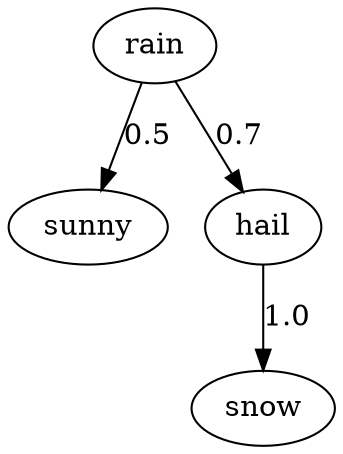

# Margin
Margin is an utterly useuless compiler for Markov chains. You can specify your markov chains as DOT graphs.

Margin will then compile the graph to a Python implementation of the Markov chain in a class.
```
python margin.py weather_markov_chain.dot
```
```python
# weather_markov_chain.py
class my_markov_chain:
	.
	.
	.
```

And you can use it as follows
```python
my_weather_predictor = my_markov_chain("rainy")
my_weather_predictor.step()
```
