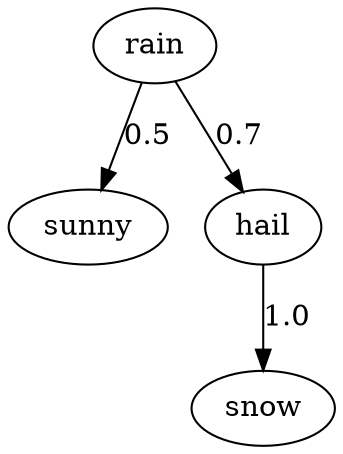

## What it is
margin is a compiler for Markov chains written in the DOT language to implementations in the Python programming language.

## How to use it
All you have to do is make a DOT file describing the graph of the desired Markov chain.


margin can then compile the graph to a Python implementation of the Markov Chain.
```
python margin.py weather_markov_chain.dot
```

This will compile to the following Python code.
```python
# weather_markov_chain.py
class my_markov_chain:
    def __init__(self, initial_state):
      self.curr_state = initial_state

    def step(self, probability):
      if self.curr_state == "rain":
        if probability < 0.4166666666666667:
          self.curr_state = "sunny"
        elif probability < 0.5833333333333334:
          self.curr_state = "hail"
      elif self.curr_state == "hail":
        if probability < 1.0:
          self.curr_state = "snow"

    def next(self):
      if self.curr_state == "rain":
        return ['sunny', 'hail']
      elif self.curr_state == "hail":
        return ['snow']
      else:
      return []
```

And you can use it as follows
```
my_weather_predictor = my_markov_chain("rainy")
my_weather_predictor.step()

## What can I use it for
I guess you could use it to somehow streamline building hardcoded Markov chain implementations, but...
I'm not really sure to be honest.
